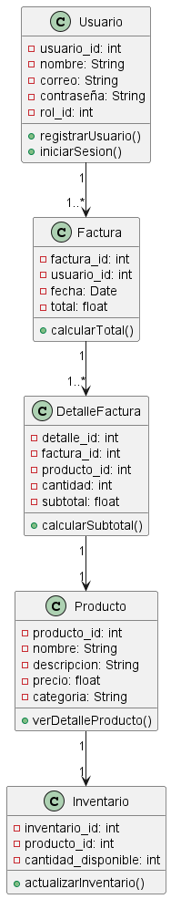

# Sistema de Carrito de Compras

## Descripción General
Este proyecto desarrolla una base de datos para un sistema de carrito de compras, manejando roles de **Administrador** y **Comprador**. Incluye funcionalidades como registro de usuarios, gestión de inventarios, y generación de facturas. La base de datos emplea las entidades **Usuario**, **Producto**, **Inventario**, **Factura** y **Detalle Factura**.

---

## Estructura de la Base de Datos

### Entidades y Relaciones
A continuación, se detallan las entidades y sus relaciones principales:

1. **Usuario**
    - **Atributos**:
        - `usuario_id`: Identificador único.
        - `nombre`: Nombre del usuario.
        - `correo`: Dirección de correo electrónico.
        - `contraseña`: Contraseña del usuario.
        - `rol_id`: Relaciona con el rol (Administrador o Comprador).
    - **Métodos**:
        - `registrarUsuario()`: Registra un nuevo usuario.
        - `iniciarSesion()`: Permite al usuario iniciar sesión.

2. **Producto**
    - **Atributos**:
        - `producto_id`: Identificador único.
        - `nombre`: Nombre del producto.
        - `descripcion`: Descripción detallada.
        - `precio`: Precio del producto.
        - `categoria`: Categoría del producto.
    - **Métodos**:
        - `verDetalleProducto()`: Muestra el detalle del producto.

3. **Inventario**
    - **Atributos**:
        - `inventario_id`: Identificador único.
        - `producto_id`: Relaciona con el producto.
        - `cantidad_disponible`: Cantidad disponible en inventario.
    - **Métodos**:
        - `actualizarInventario()`: Actualiza el stock.

4. **Factura**
    - **Atributos**:
        - `factura_id`: Identificador único.
        - `usuario_id`: Relaciona con el usuario que generó la factura.
        - `fecha`: Fecha de la factura.
        - `total`: Total de la factura.
    - **Métodos**:
        - `calcularTotal()`: Calcula el total de la factura.

5. **DetalleFactura**
    - **Atributos**:
        - `detalle_id`: Identificador único.
        - `factura_id`: Relaciona con la factura.
        - `producto_id`: Relaciona con el producto.
        - `cantidad`: Cantidad del producto en la factura.
        - `subtotal`: Subtotal de cada producto.
    - **Métodos**:
        - `calcularSubtotal()`: Calcula el subtotal para el producto.

---

## Diagrama de Clases

A continuación, se presenta el diagrama de clases en formato WSD:

```wsd
@startuml
class Usuario {
    - usuario_id: int
    - nombre: String
    - correo: String
    - contraseña: String
    - rol_id: int
    + registrarUsuario()
    + iniciarSesion()
}

class Producto {
    - producto_id: int
    - nombre: String
    - descripcion: String
    - precio: float
    - categoria: String
    + verDetalleProducto()
}

class Inventario {
    - inventario_id: int
    - producto_id: int
    - cantidad_disponible: int
    + actualizarInventario()
}

class Factura {
    - factura_id: int
    - usuario_id: int
    - fecha: Date
    - total: float
    + calcularTotal()
}

class DetalleFactura {
    - detalle_id: int
    - factura_id: int
    - producto_id: int
    - cantidad: int
    - subtotal: float
    + calcularSubtotal()
}

Usuario "1" --> "1..*" Factura
Factura "1" --> "1..*" DetalleFactura
DetalleFactura "1" --> "1" Producto
Producto "1" --> "1" Inventario
@enduml
```

## Imagen de Referencia

