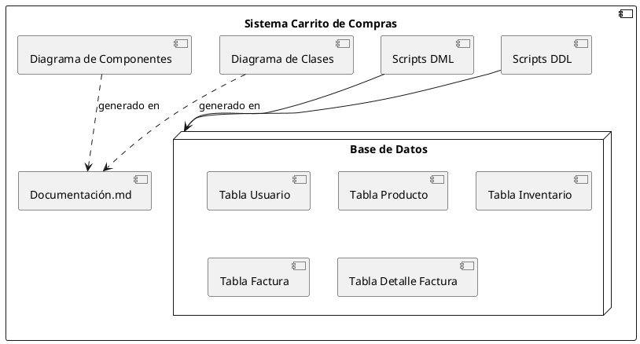
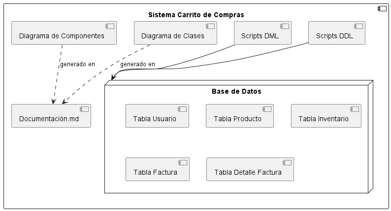

# Diagrama de Componentes 

### Componentes Principales

1. **Scripts DDL**: 
   - Contiene los comandos SQL de definición de datos que crean la estructura de la base de datos (tablas y relaciones).
   - Ejemplo de archivos en este componente: `crear_tablas.sql`, que define las tablas principales (`Usuario`, `Producto`, `Inventario`, `Factura`, y `DetalleFactura`).

2. **Scripts DML**: 
   - Incluye comandos SQL de manipulación de datos para realizar operaciones de inserción, actualización y eliminación en las tablas del sistema.
   - Ejemplo de archivos en este componente: `insertar_datos.sql`, con datos iniciales de productos, usuarios y facturas.

3. **Diagrama de Clases**:
   - Generado en el archivo `diagramas.puml`, este diagrama representa las relaciones entre entidades (clases) del sistema, como `Usuario`, `Producto`, `Inventario`, `Factura` y `DetalleFactura`.
   - Este componente permite la visualización de la estructura y atributos de cada clase, ayudando a diseñar y comprender el modelo de datos.

4. **Diagrama de Componentes**:
   - Este diagrama, también en `diagramas.puml`, refleja cómo interactúan entre sí los diferentes componentes del sistema.
   - Su propósito es clarificar la relación física y lógica entre los scripts y la base de datos.

5. **Base de Datos**:
   - Es el núcleo donde se almacenan y gestionan los datos de las entidades del sistema de carrito de compras.
   - Contiene las tablas mencionadas (e.g., `Usuario`, `Producto`, `Inventario`, `Factura`, `DetalleFactura`).

### Ejemplo de Código PlantUML para el Diagrama de Componentes

## imagen de referncial

