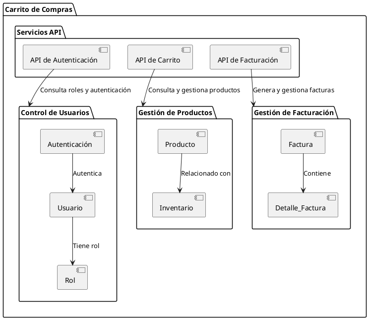
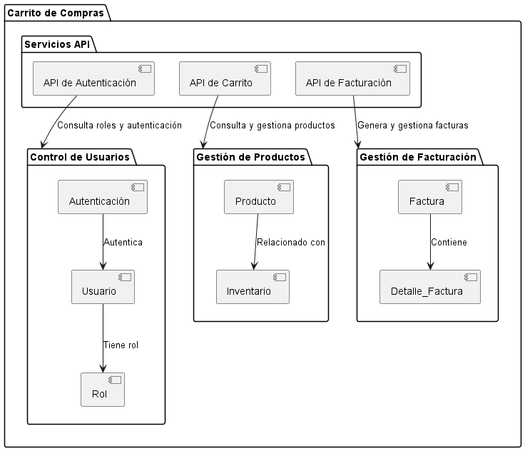

# Documentación del Diagrama de Paquetes para el Sistema de Carrito de Compras

Este diagrama de paquetes organiza el sistema de carrito de compras en varios módulos o componentes, agrupándolos en paquetes de acuerdo con su funcionalidad en el sistema.

---

## Diagrama de Paquetes

## Imagen de referncia
