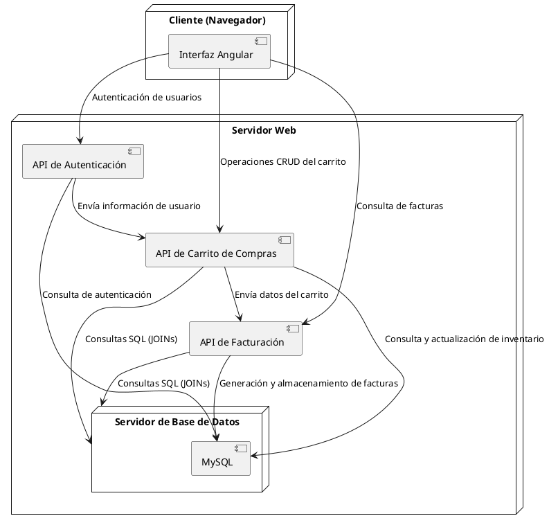
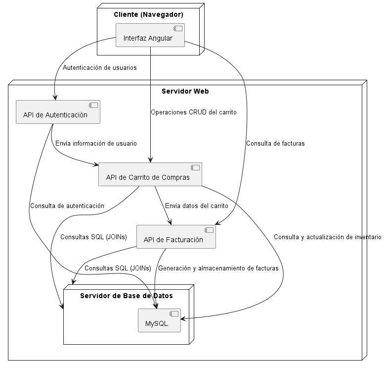

# Documentación del Diagrama de Despliegue para el Sistema de Carrito de Compras

El proyecto del sistema de carrito de compras consiste en desarrollar una base de datos con roles de administrador y comprador, donde se realizarán consultas SQL entre varias entidades. Este documento describe la distribución física de los nodos y artefactos que se ejecutan en el sistema.

---

## Diagrama de Despliegue

## Imagen de referncia
