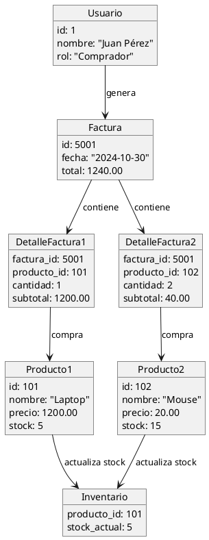
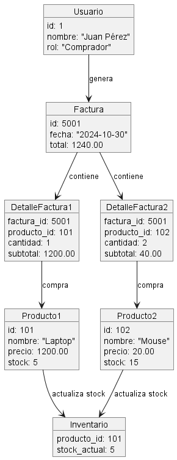

# Proyecto de Base de Datos para Carrito de Compras

## Descripción del Proyecto
Este proyecto tiene como objetivo desarrollar un sistema de carrito de compras en el que se manejen dos roles: **Administrador** y **Comprador**. La base de datos debe incluir consultas SQL usando `JOIN` entre las siguientes entidades:

- **Usuario**
- **Producto**
- **Inventario**
- **Factura**
- **Detalle Factura**

## Diagrama de Objetos

### ¿Qué es un Diagrama de Objetos?
Un Diagrama de Objetos representa un instante específico de como se relacionan las clases en un momento dado. En este caso, muestra ejemplos de cómo un **Usuario** (como cliente) realiza una compra de **Productos**, generando una **Factura** y actualizando el **Inventario**.

### Ejemplo de Diagrama de Objetos en PlantUML

## Imagen del diagrama

