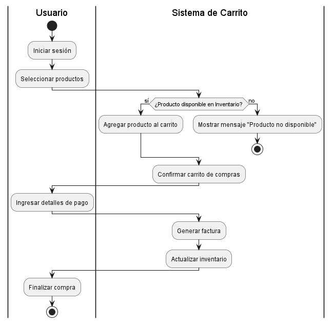

**explicacion** 
------------------------------------------------
Este diagrama de actividad en PlantUML representa el flujo de una compra en un sistema de carrito, donde el usuario inicia sesión, selecciona productos y el sistema verifica su disponibilidad en inventario. Si los productos están disponibles, el usuario puede añadirlos al carrito, confirmar la compra, y proporcionar los detalles de pago. El sistema entonces genera una factura y actualiza el inventario. Finalmente, el proceso concluye cuando el usuario finaliza la compra o, si los productos no están disponibles, recibe un mensaje de error y el flujo se detiene.

-------------------------------------
**codigo diagrama de actividad**
---------------------------------  
-@startuml  
|Usuario|  
start  
:Iniciar sesión;  
:Seleccionar productos;  
|Sistema de Carrito|  
if (¿Producto disponible en Inventario?) then (sí)  
  :Agregar producto al carrito;  
else (no)  
  :Mostrar mensaje "Producto no disponible";  
  stop  
endif  

:Confirmar carrito de compras;  
|Usuario|  
:Ingresar detalles de pago;  
|Sistema de Carrito|  
:Generar factura;  
:Actualizar inventario;  
|Usuario|  
:Finalizar compra;  
stop  
@enduml  

----------------------------------
**diagrama** 
---------------------------------

