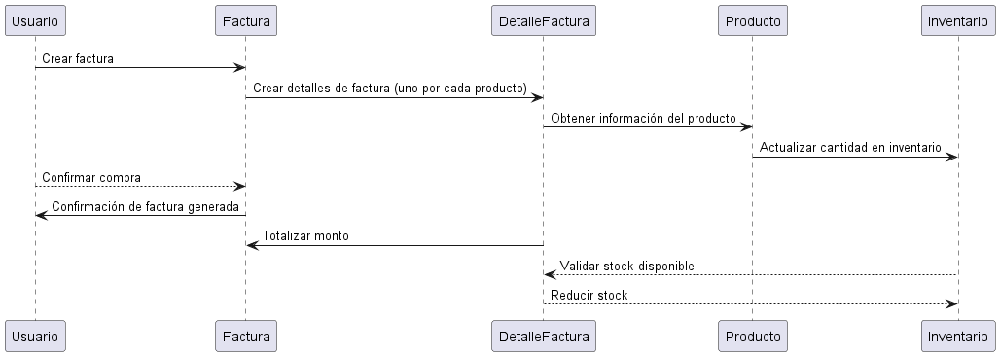

**explicacion** 
------------------------------------------------

Este diagrama de colaboración muestra cómo un usuario inicia la compra creando una factura, y el sistema genera los detalles para cada producto seleccionado. Cada detalle consulta la información del producto y, a su vez, verifica el stock en el inventario, actualizándolo al restar las cantidades compradas. Al final del proceso, el sistema totaliza el monto de la factura y envía al usuario una confirmación de compra exitosa, completando la interacción entre las entidades y reflejando su colaboración en el flujo de una compra en el sistema.

-------------------------------------
**codigo diagrama de colaboración**
---------------------------------  
-@startuml  

participant Usuario as U  
participant Factura as F  
participant DetalleFactura as DF  
participant Producto as P  
participant Inventario as I  

U -> F : Crear factura  
F -> DF : Crear detalles de factura (uno por cada producto)  
DF -> P : Obtener información del producto  
P -> I : Actualizar cantidad en inventario  

U --> F : Confirmar compra  
F -> U : Confirmación de factura generada  
DF -> F : Totalizar monto  
I --> DF : Validar stock disponible  
DF --> I : Reducir stock  

@enduml   

----------------------------------
**diagrama** 
---------------------------------

