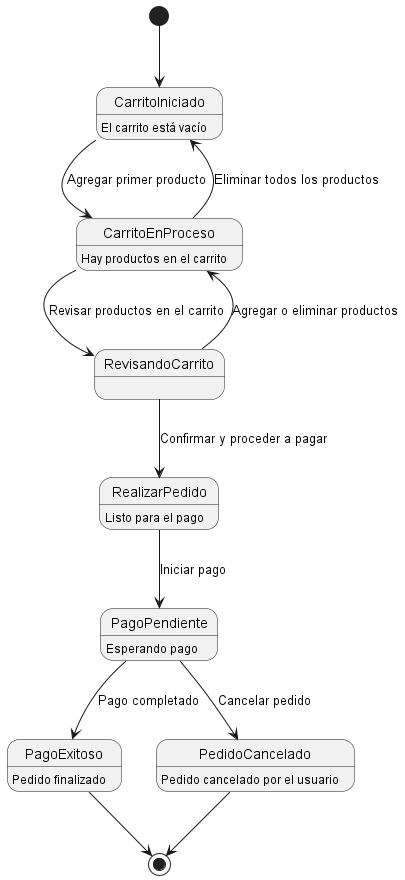

**explicacion** 
-----------------------------  

Este diagrama muestra cómo evoluciona el carrito de compras desde el momento en que está vacío hasta que el pedido se completa o se cancela. Comienza con el carrito vacío. A medida que el usuario añade productos, el carrito pasa a estar “en proceso”, permitiéndole revisar los artículos y hacer ajustes. Cuando todo está listo, el usuario confirma su pedido y procede al pago. Si el pago se realiza correctamente, el pedido queda “completado”. En cambio, si decide cancelar, el proceso termina con el pedido en estado de “cancelado”. Todo fluye de forma natural para reflejar una experiencia de compra realista.

---------------------------------------

código WSD del diagrama de estado
------------------------------------------
-@startuml  
[*] --> CarritoIniciado  

CarritoIniciado : El carrito está vacío  
CarritoIniciado --> CarritoEnProceso : Agregar primer   producto   
CarritoEnProceso : Hay productos en el carrito  
CarritoEnProceso --> CarritoIniciado : Eliminar todos los   productos  
CarritoEnProceso --> RevisandoCarrito : Revisar productos en el carrito  

RevisandoCarrito --> CarritoEnProceso : Agregar o eliminar productos  
RevisandoCarrito --> RealizarPedido : Confirmar y proceder a pagar  

RealizarPedido : Listo para el pago  
RealizarPedido --> PagoPendiente : Iniciar pago  
PagoPendiente : Esperando pago  
PagoPendiente --> PagoExitoso : Pago completado  
PagoExitoso : Pedido finalizado  

PagoPendiente --> PedidoCancelado : Cancelar pedido  
PedidoCancelado : Pedido cancelado por el usuario  

PagoExitoso --> [*]  
PedidoCancelado --> [*]  
@enduml  

----------------------------------------
**diagrama** 
---------------------------------------

