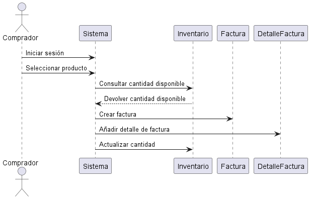

**explicacion** 
------------------------------------------------

Este diagrama de secuencia representa el proceso de compra de un comprador en un sistema de carrito de compras. Primero, el comprador selecciona un producto, tras lo cual el sistema consulta el inventario para verificar si hay suficiente cantidad disponible. Si es así, se genera una factura y se registran los detalles del producto en la misma, incluyendo la cantidad y el precio. Finalmente, el sistema actualiza el inventario para reflejar la cantidad descontada, asegurando que la compra esté registrada y que el inventario esté al día. 

-------------------------------------
codigo diagrama de secuencia
---------------------------------  

-@startuml  
actor Comprador  
participant "Sistema" as Sistema  
participant "Inventario" as Inventario  
participant "Factura" as Factura  
participant "DetalleFactura" as DetalleFactura  

Comprador -> Sistema : Iniciar sesión   
Comprador -> Sistema : Seleccionar producto  
Sistema -> Inventario : Consultar cantidad disponible  
Inventario --> Sistema : Devolver cantidad disponible  
Sistema -> Factura : Crear factura  
Sistema -> DetalleFactura : Añadir detalle de factura  
Sistema -> Inventario : Actualizar cantidad  
@enduml

----------------------------------
**diagrama** 
---------------------------------

  

