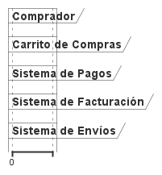

**explicacion** 
-----------------------------
En este diagrama vemos los pasos que sigue un comprador en una tienda en línea. Primero, el usuario añade productos a su carrito y los revisa. Al decidir finalizar la compra, el carrito envía los detalles al sistema de pagos. Si el pago es exitoso, el sistema de facturación genera una factura y el sistema de envíos le envía al usuario un correo con el código de seguimiento para que esté al tanto de su pedido. Es un flujo pensado para que el comprador tenga claridad en cada etapa de su compra, desde la selección hasta el envío del producto.

---------------------------------------

código WSD del diagrama de tiempo
------------------------------------------
-@startuml  
robust "Comprador" as Comprador  
robust "Carrito de Compras" as Carrito  
robust "Sistema de Pagos" as Pagos  
robust "Sistema de Facturación" as Facturacion  
robust "Sistema de Envíos" as Envios  

Comprador -> Carrito : Agregar productos al carrito  
Carrito -> Comprador : Confirmar productos agregados  
Comprador -> Carrito : Revisar y actualizar carrito  
Comprador -> Carrito : Proceder a pago  
Carrito -> Pagos : Enviar datos de compra para pago  

Pagos -> Carrito : Confirmación de pago exitoso  
Carrito -> Facturacion : Generar factura  
Facturacion -> Comprador : Enviar factura por correo  
Facturacion -> Envios : Notificar para iniciar envío  
Envios -> Comprador : Confirmación de envío y código de seguimiento  

@enduml  

----------------------------------------
**diagrama** 
---------------------------------------

